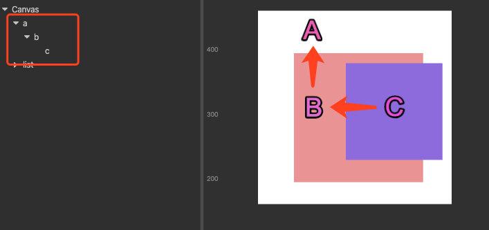
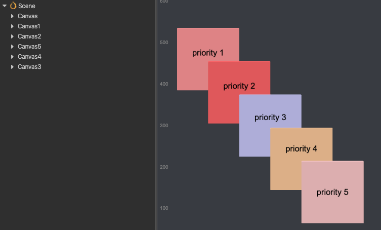
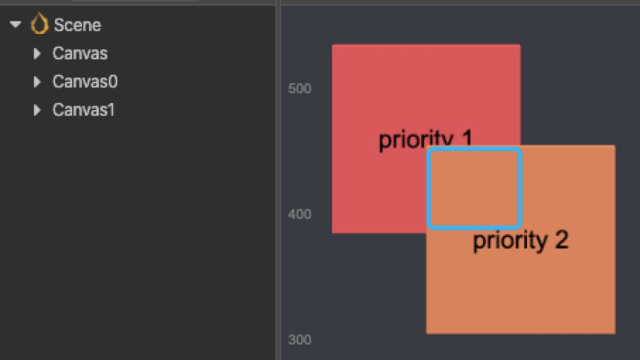
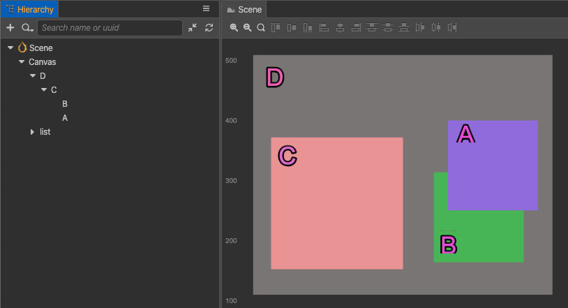

# Node System Events

As stated in the last file, cc.Node has a whole set of [event listener and dispatch mechanisms](event-emit.md). Based on this mechanism, we provide some basic system events. This file will introduce the system events related to Node hierarchy.

Cocos Creator supports four types of system events: mouse, touch, keyboard, device motion. They are called [Global Events](event-input.md). This document will mainly discuss the usage of touch and mouse events which is dispatched by related `cc.Node`.

System events follow the general register method, developers can register event listener not only by using the enumeration type but also by using the event name directly. It is recommended to use enumeration for event registration to avoid event registration failure due to writing problems.

```ts
// Use enumeration type to register
node.on(Node.EventType.MOUSE_DOWN, (event) => {
  console.log('Mouse down');
}, this);

// Use event name to register
node.on('mouse-down', (event) => {
  console.log('Mouse down');
}, this);
```

## Mouse event type and event object

The Mouse event will only be triggered on desktop platforms, the event types the system provides are as follows:

| Enumeration object definition                 | Corresponding event name             | Event trigger timing             |
| :-------------             | :----------            |   :----------        |
| cc.Node.EventType.MOUSE_DOWN      |  mouse-down             | trigger once when mouse down in the target node region                      |
| cc.Node.EventType.MOUSE_ENTER     |   mouse-enter            | when the mouse enters the target node region, regardless if it is down                                                                    |
| cc.Node.EventType.MOUSE_MOVE      |  mouse-move       | when the mouse moves in the target node region, regardless if it is down    |
| cc.Node.EventType.MOUSE_LEAVE     |   mouse-leave     | when the mouse leaves the target node region, regardless if it is down
| cc.Node.EventType.MOUSE_UP        | mouse-up          | trigger once when the mouse is released from the down state     |
| cc.Node.EventType.MOUSE_WHEEL     |  mouse-wheel      | when the mouse wheel rolls               |

The important APIs of mouse events (`cc.Event.EventMouse`) are described in the [Mouse Events API](event-api.md#Mouse-Event-API)(`cc.Event` standard events API excluded).

## Touch event types and event objects

Touch events can be triggered on both mobile platforms and desktop platforms. So developers can better debug on the desktop platform, by simply listening for touch events and responding to both mobile touch events and desktop mouse events at the same time. The types of touch events provided by the system are as follows:

| Enumeration object definition                 | Corresponding event name             | Event trigger timing             |
| :-------------             | :----------            |   :----------        |
| cc.Node.EventType.TOUCH_START | touch-start | when the finger touches the screen in the target node region                |
| cc.Node.EventType.TOUCH_MOVE | touch-move | when the finger moves on screen                            |
| cc.Node.EventType.TOUCH_END | touch-end | when the finger leaves screen in the target node region                      |
| cc.Node.EventType.TOUCH_CANCEL | touch-cancel | when the finger leaves screen outside the target node region                    |

The important APIs of touch event (`cc.Event.EventTouch`) are described in the [Mouse Events API](event-api.md#Touch-Event-API)(`cc.Event` standard event API excluded):

Note, touch events support multi-touch, each touch spot will send one event to the event listener.

## Touch event propagation

### Touch event bubbles

Touch events support the event bubbles on the node tree, take the pictures below as an example:



In the scene shown in the picture, suppose node A has a child node B which has a child node C. The developer set the touch event listeners for all these three nodes (each node has a touch event listener in examples below by default).

When the mouse or finger was applied in the node C region, the event will be triggered at node C first and the node C listener will receive the event. Then the node C will pass this event to its parent node, so the node B listener will receive this event. Similarly the node B will also pass the event to its parent node A. This is a basic event bubbling phase. It needs to be emphasized that there is no hit test in parent nodes in the bubbling phase, which means that the node A and B can receive touch events even though the touch location is out of their node region.

The bubbling phase of touch events is no different than the general events. So, calling `event.propagationStopped = true;` can force to stop the bubbling phase.

### Ownership of touch points among brother nodes

Suppose the node B and C in the picture above are brother nodes, while C partly covers over B. Now if C receives a touch event, it is announced that the touch point belongs to C, which means that the brother node B won't receive the touch event any more, even though the touch location is also inside its node region. The touch point belongs to the top one among brother nodes.

At the same time, if C has a parent node, it will also pass the touch event to its parent node through the event bubble mechanism.

### Point of Contact Attribution for Different Canvas

Contact interception between different Canvas is determined by priority. In the scene in the figure below, Canvas 1-5 in the node tree corresponds to priority 1-5 of the image display. It can be seen that even though Canvas nodes 3, 4, and 5 are arranged in scrambled order, the order of response of the contacts is still **Canvas5 -> Canvas4 -> Canvas3 -> Canvas2 -> Canvas1**, according to the priority relationship on the Canvas. The sorting between Canvas is done in the order of the node tree only if the priority is the same.



### Register touch or mouse events in the capturing phase

Sometimes we need to dispatch the touch or mouse events to parent node event listeners before dispatching to any child nodes beneath it in hierarchy, like the design of cc.ScrollView component.

Now the event bubbling can't meet our demand, so that we need to register the parent node event listeners in the capturing phase.
To achieve this goal, we can pass the fourth parameter `true` when registering touch or mouse event on node, which means `useCapture`. For example:

```ts
this.node.on(Node.EventType.TOUCH_START, this.onTouchStartCallback, this, true);
```

When node fires `touch-start` event, the `touch-start` event will be firstly dispatched to all the parent node event listeners registered in the capturing phase, then dispatched to the node itself, and finally comes the event bubbling phase.

Only touch or mouse events can be registered in the capturing phase, while the other events can't be.

### Event Interception

Normal events are dispensed as described above. However, if the node has components such as `Button`, `Toggle` or `BlockInputEvents` on it, it will stop event bubbling. Again, look at the picture below. There are two buttons, priority 1 for Canvas0 and priority 2 for Canvas1. If you click on the intersection of the two buttons, which is the blue area in the picture, it appears that button priority 2 received the contact event successfully, while button priority 1 did not. That's because according to the event reception rules above, button priority 2 receives contact events first and intercepts them（`event.propagationStopped = true`）to prevent event penetration. If the node is a non-button node, events can also be intercepted by adding the `BlockInputEvents` component to prevent penetration.



## Example for touch events

Let's make a summary of touch event propagation with the example below. There are four nodes A, B, C and D in the picture above, where A and B are brother nodes.
The specific hierarchical relationship should be like this:



1. If one touch is applied in the overlapping area between A and B, now B won't receive the touch event, so that propagating order of the touch event should be **A -> C -> D**.
2. If the touch location is in node B ( the visible blue area ), the order should be **B -> C -> D**.
3. If the touch location is in node C, the order should be **C -> D**.
4. As a precondition to the second case, we register touch events on C D node in the capturing phase, then the order should be **D -> C -> B**.

## Other events of cc.Node

All node built-in events can get event names from `Node.EventType`.

### 3D Node Events

| Enumeration Object Definitions              | Corresponding event name             | Event trigger timing             |
| :-------------             | :----------            |   :----------        |
| **TRANSFORM_CHANGED** | transform-changed | When a transform attribute is modified, an enum value `TransformBit` is assigned that defines the modified transform based on the enum value.                      |

Definition of Transformation Enumeration Values:

| Enumeration Value Meanings               | transformations             |
| :-------------             | :----------            |
| **TransformBit.NONE**       | Properties are unchanged                      |
| **TransformBit.POSITION**   | Node position change                      |
| **TransformBit.ROTATION**   | Node rotation change                      |
| **TransformBit.SCALE**      | Node scale change                      |
| **TransformBit.RS**         | Node rotation and scale changes                      |
| **TransformBit.TRS**        | Node position, rotation and scale changes 。                      |

### 2D Node Events

| Enumeration Value Meanings               | Corresponding event name             | Event trigger timing             |
| :-------------             | :----------            |   :----------        |
| **SIZE_CHANGED** | size-changed | When the width/height attribute is modified. The width/height attribute is located on the `UITransform` component.                      |
| **ANCHOR_CHANGED** | anchor-changed | When the anchor X/Y attribute is modified. The width/height attribute is located on the `UITransform` component.                      |
| **COLOR_CHANGED** | color-changed | When the color attribute is modified. The width/height attribute is located on the `UITransform` component.

## Multi-touch Event

The engine has a multi-touch event blocking switch. Multi-touch events are enabled by default. For projects that do not require multi-touch, you can disable allowing multi-touch with the following code:

```ts
cc.macro.ENABLE_MULTI_TOUCH = false;
```

Alternatively, it can be configured via **Project Setting/Macro Config**.

## Pause or resume node system events

Pause node system events

```ts
// Pause all node system events registered on the current node. Node system events include Touch and Mouse Events.
// If a parameter true is passed, the API will pause node system events on this node and all its children.
// Example
this.node.pauseSystemEvents();
```

Resume node system events

```ts
// Resume all node system events registered on the current node. Node system events include Touch and Mouse Events.
// If a parameter true is passed, the API will resume node system events on this node and all its children.
// Example
this.node.resumeSystemEvents();
```
